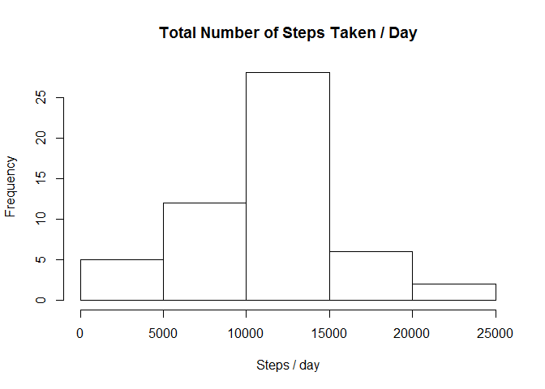
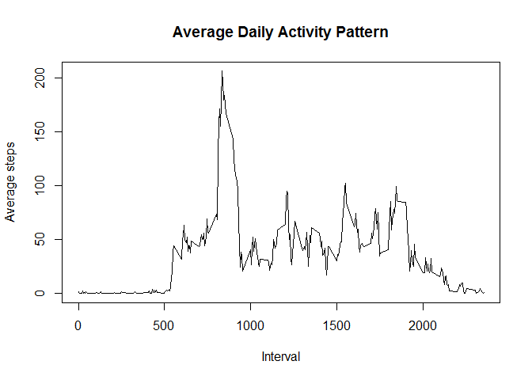
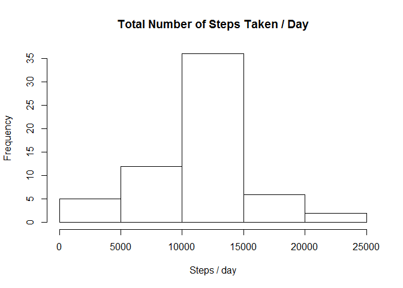

# Reproducible Research: Peer Assessment 1


## Loading and preprocessing the data
1. Load the data (i.e. read.csv())
2. Process/transform the data (if necessary) into a format suitable for your analysis

```r
# Load libraries
library(dplyr)
```

```
## 
## Attaching package: 'dplyr'
## 
## The following objects are masked from 'package:stats':
## 
##     filter, lag
## 
## The following objects are masked from 'package:base':
## 
##     intersect, setdiff, setequal, union
```

```r
library(lattice)

# Set working directory
setwd("C:/Program Files/Git/Projects/RepData_PeerAssessment1")

#Load data file
dfActivity = read.csv("activity.csv", stringsAsFactors = FALSE)

#Preprocessing steps for efficient execution
```


## What is mean total number of steps taken per day?
1. Calculate the total number of steps taken per day
2. If you do not understand the difference between a histogram and a barplot, research the difference between them. Make a histogram of the total number of steps taken each day
3. Calculate and report the mean and median of the total number of steps taken per day

```r
#Calculate the total number of steps taken per day
totalSteps <- aggregate(steps ~ date, dfActivity, sum, na.rm = TRUE)

#Histogram of the total number of steps taken each day
hist(totalSteps$steps, main = "Total Number of Steps Taken / Day",
     xlab = "Steps / day")
```

 

```r
#Calculate and report the mean and median of the total number of steps taken per day
summary(totalSteps)
```

```
##      date               steps      
##  Length:53          Min.   :   41  
##  Class :character   1st Qu.: 8841  
##  Mode  :character   Median :10765  
##                     Mean   :10766  
##                     3rd Qu.:13294  
##                     Max.   :21194
```


## What is the average daily activity pattern?
1. Make a time series plot (i.e. type = "l") of the 5-minute interval (x-axis) and the average number of steps taken, averaged across all days (y-axis)
2. Which 5-minute interval, on average across all the days in the dataset, contains the maximum number of steps?

```r
#Time series plot (i.e. type = "l") of the 5-minute interval (x-axis) and the average number of steps taken, averaged across all days (y-axis)
averageSteps <- aggregate(steps ~ interval, dfActivity, mean)
plot(averageSteps$interval, averageSteps$steps, type = "l",
     main = "Average Daily Activity Pattern", 
     xlab = "Interval", ylab = "Average steps")
```

 

```r
#5-minute interval with maximum number of steps
averageSteps[which.max(averageSteps$steps), ]
```

```
##     interval    steps
## 104      835 206.1698
```


## Imputing missing values
1. Calculate and report the total number of missing values in the dataset (i.e. the total number of rows with NAs)
2. Devise a strategy for filling in all of the missing values in the dataset. The strategy does not need to be sophisticated. For example, you could use the mean/median for that day, or the mean for that 5-minute interval, etc.
3. Create a new dataset that is equal to the original dataset but with the missing data filled in.
4. Make a histogram of the total number of steps taken each day and Calculate and report the mean and median total number of steps taken per day. Do these values differ from the estimates from the first part of the assignment? What is the impact of imputing missing data on the estimates of the total daily number of steps?

```r
#Total number of missing values in the dataset
sum(is.na(dfActivity$steps))
```

```
## [1] 2304
```

```r
#Fill in missing value - using the mean for the 5-min interval
dfActivityNoNAs <- dfActivity
for (i in 1:nrow(dfActivityNoNAs)) {
    if (is.na(dfActivityNoNAs$steps[i])) {
        dfActivityNoNAs$steps[i] <-
            averageSteps$steps[match(dfActivityNoNAs$interval[i],
                                     averageSteps$interval)]
    }
}

#Calculate the total number of steps taken per day
totalStepsNoNAs <- aggregate(steps ~ date, dfActivityNoNAs, sum, na.rm = TRUE)

#Histogram of the total number of steps taken each day
hist(totalStepsNoNAs$steps, main = "Total Number of Steps Taken / Day",
     xlab = "Steps / day")
```

 

```r
#Mean & median of the total number of steps taken per day - no missing values
summary(totalStepsNoNAs)
```

```
##      date               steps      
##  Length:61          Min.   :   41  
##  Class :character   1st Qu.: 9819  
##  Mode  :character   Median :10766  
##                     Mean   :10766  
##                     3rd Qu.:12811  
##                     Max.   :21194
```

```r
#Mean & median of the total number of steps taken per day - WITH missing values
summary(totalSteps)
```

```
##      date               steps      
##  Length:53          Min.   :   41  
##  Class :character   1st Qu.: 8841  
##  Mode  :character   Median :10765  
##                     Mean   :10766  
##                     3rd Qu.:13294  
##                     Max.   :21194
```
The strategy used to fill in the missing values has no impact to the Mean, however the Median value has increased compared to the data with missing values.


## Are there differences in activity patterns between weekdays and weekends?
1. Create a new factor variable in the dataset with two levels - "weekday" and "weekend" indicating whether a given date is a weekday or weekend day.
2. Make a panel plot containing a time series plot (i.e. type = "l") of the 5-minute interval (x-axis) and the average number of steps taken, averaged across all weekday days or weekend days (y-axis). See the README file in the GitHub repository to see an example of what this plot should look like using simulated data.

```r
#Create factor variable for weekday or weekend
dfActivityNoNAs$dayType <- 
    ifelse(weekdays(as.Date(dfActivityNoNAs$date)) %in% c("Saturday", "Sunday"),
           "weekend", "weekday")
dfActivityNoNAs$dayType <- factor(dfActivityNoNAs$dayType)

#Average number of steps taken across all weekday or weekeed days
plotData <- dfActivityNoNAs %>%
    group_by(dayType, interval) %>%
    summarize(averageSteps = mean(steps))

xyplot(plotData$averageSteps ~ plotData$interval | plotData$dayType, 
       layout = c(1,2), type="l", 
       ylab="Number of steps", xlab = "Interval" ) 
```

 
